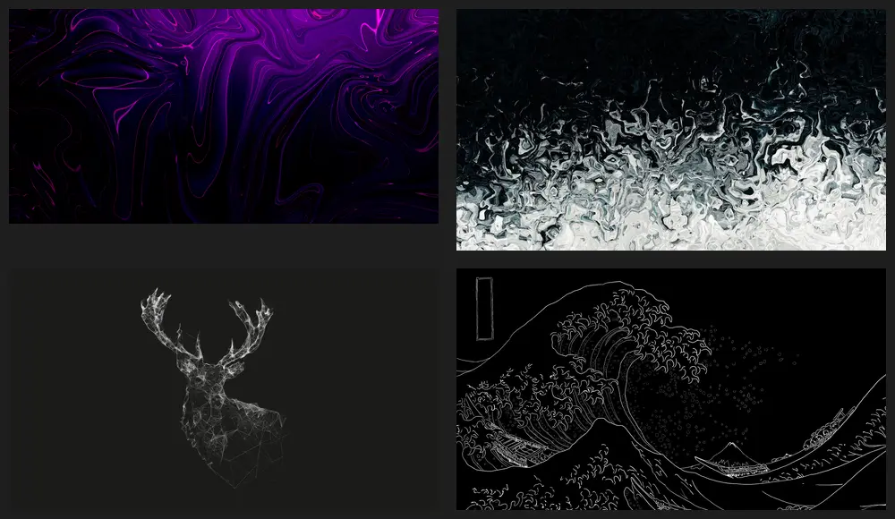

# wallpapers
> the repository for my wallpapers that i have :)

# 📁 Structure
```
wallpapers
├── desktops
├── mobile
└── scripts
```

# Categories
## Desktops Wallpapers

High-resolution wallpapers optimized for 16:9 and ultrawide screens

 - abstract
 - anime
 - architecture
 - artworks
 - cityscape
 - dynamic
 - extra
 - gaming
 - linux
 - minimal
 - nature
 - pixel-art
 - space
 - technology
 - vehicles
 - windows

## Mobile Wallpapers
 - abstract
 - anime
 - artworks
 - minimal

# Preview

Each category includes a thumbnail preview generated from selected wallpapers.

### Desktops

|Categories|thumbnail|
|----------|---------|
| abstract |  |
| anime |  |
| architecture |  |
| artworks |  |
| cityscape |  |
| dynamic |  |
| extra |  |
| gaming |  |
| linux |  |
| minimal |  |
| nature |  |
pixel-| art |  |
| space |  |
| technology |  |
| vehicles |  |
| windows |  |


# Usage

You can download or clone the repository:

```bash
git clone https://github.com/cyber-null/wallpapers.git
```

Then browser categories and pick wallpapers manually.


> [!TODO]
> - [x] add directories
> - [ ] add wallpapers
> - [ ] rename wallpapers
> - [ ] create some thumbnail wallpapers for README
> - [ ] write Main README.md
> - [ ] write for every dir README.md
> - [x] write preview generator shell scripts
