# wallpapers
> My personal collection of wallpapers for Landscape and portrait devices.

# 📁 Structure
```
wallpapers
├── assets
│   └── thumbnails
├── landscape
├── portrait
└── scripts
```

## Wallpaper Orientation

Wallpapers in this repository are organized by **orientation** rather than device type.

* **Landscape** — Wallpapers designed for horizontal displays, such as desktop monitors, laptops, and other widescreen devices.
* **Portrait** — Wallpapers designed for vertical displays, such as smartphones, tablets in portrait mode, and vertical monitors.


# Categories
> See the preview section below for available categories.

# Preview

Each category includes a thumbnail preview generated from selected wallpapers.

### Landscape

|Categories|thumbnail|
|----------|---------|
| [abstract](landscape/abstract/README.md) |  |
| [anime](landscape/anime/README.md) |  |
| [anime-original](landscape/anime-original/README) | 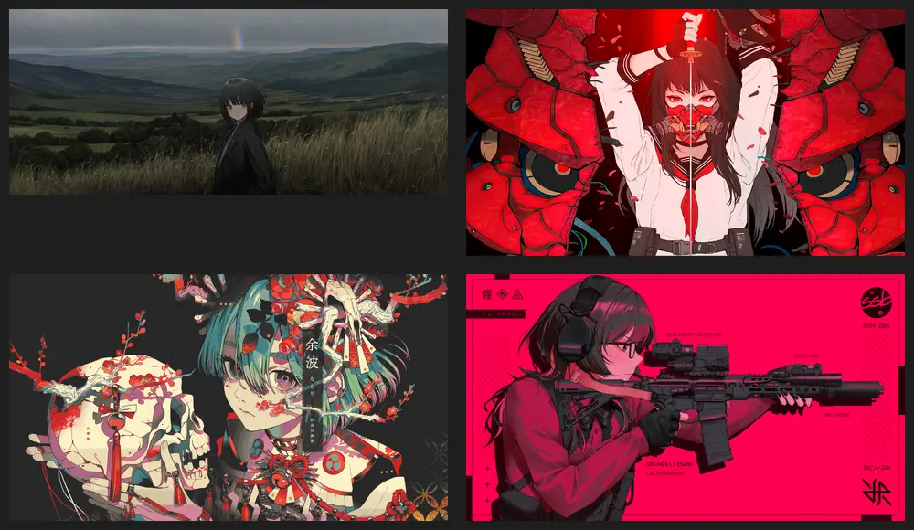
| [architecture](landscape/architecture/README.md) | 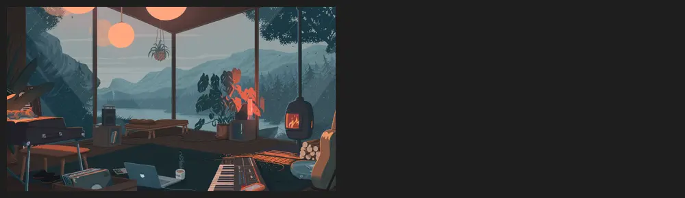 |
| [artworks](landscape/artworks/README.md) | 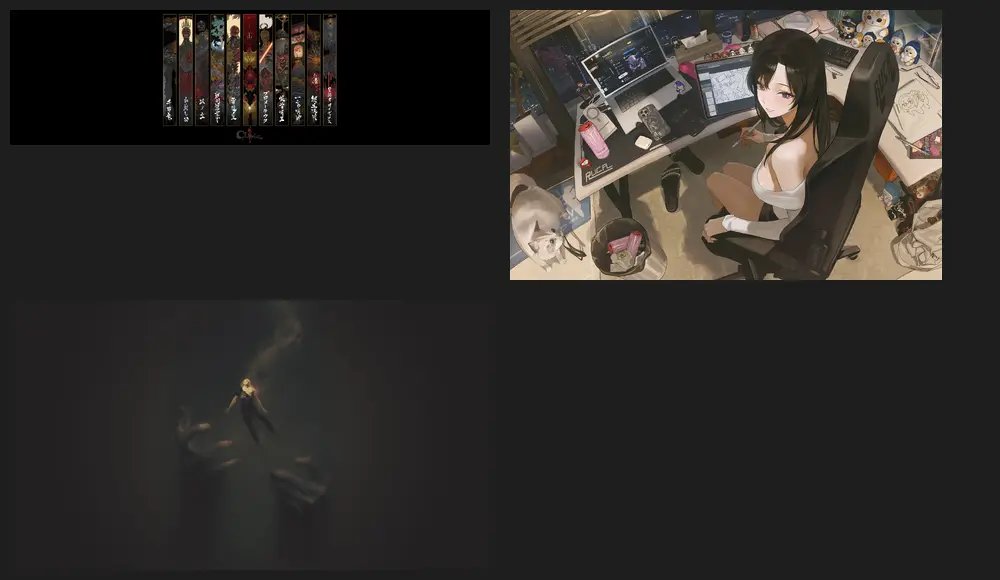 |
| [cityspace](landscape/cityspace/README.md) |  |
| dynamic |  |
| [gaming](landscape/gaming/README.md) | 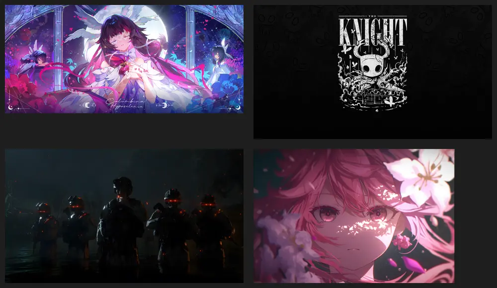 |
| [linux](landscape/linux/README.md) | 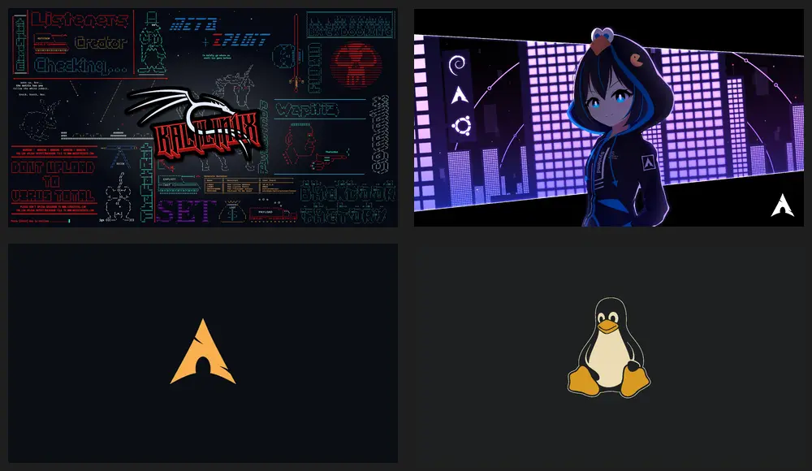 |
| [minimal](landscape/minimal/README.md) |  |
| [nature](landscape/nature/README.md) | 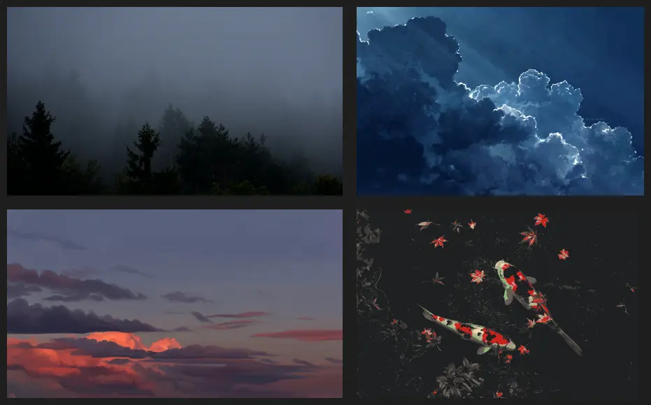 |
| [pixel-art](landscape/pixel-art/README.md) | 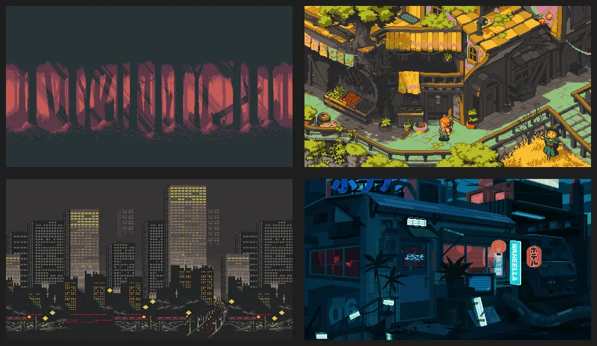 |
| [space](landscape/space/README.md) | 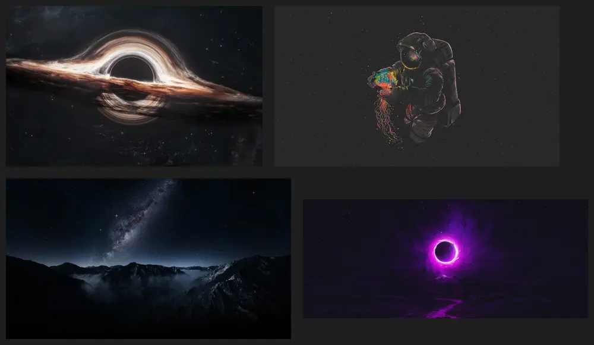 |
| [technology](landscape/technology/README.md) |  |
| [vehicles](landscape/vehicles/README.md) | 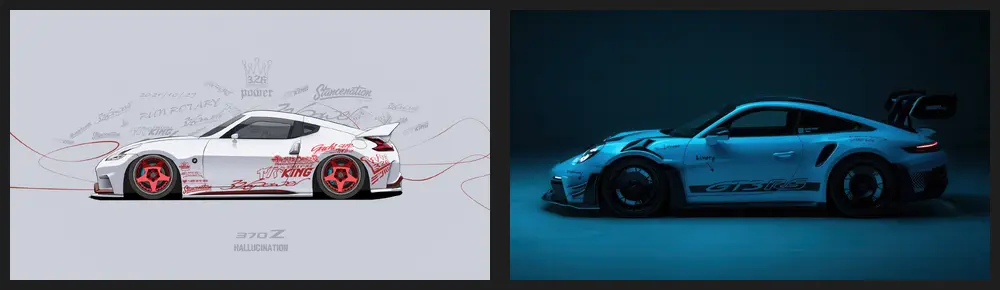 |
| [windows](landscape/technology/windows/README.md) |  |


### Portrait

| Categories | thumbnails |
| ---------- | ---------- |
| [anime](portrait/anime/README.md) | 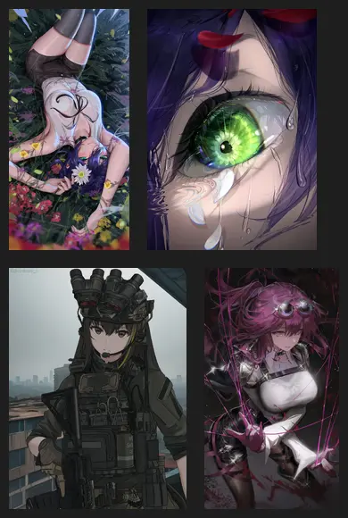 |
| [gaming](portrait/gaming/README.md)| 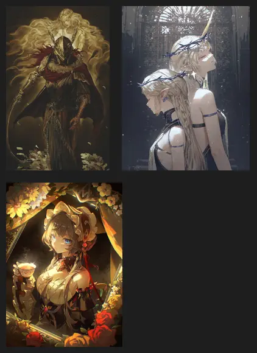 |
| [artworks](portrait/artworks/README.md) | 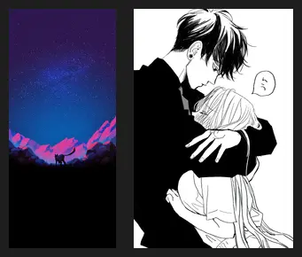 |
| [cityscape](portrait/cityspace/README.md) | 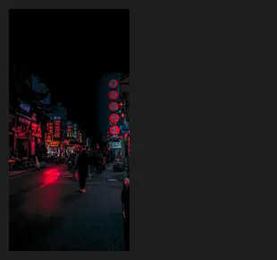 |
| [minimal](portrait/minimal/README.md) | 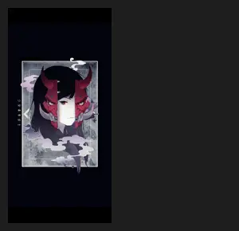 |
| [pixel-art](portrait/pixel-art/README.md) | 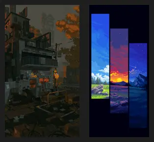 |

# Usage

You can download or clone the repository:

```bash
git clone https://github.com/cyber-null/wallpapers.git
```

Then browse categories and pick wallpapers manually.


