# wallpapers
> My personal collection of wallpapers for desktop and mobile devices.

# 📁 Structure
```
wallpapers
├── assets
│   └── thumbnails
├── desktops
├── mobile
└── scripts
```

## Wallpaper Orientation

Wallpapers in this repository are organized by **orientation** rather than device type.

* **Landscape** — Wallpapers designed for horizontal displays, such as desktop monitors, laptops, and other widescreen devices.
* **Portrait** — Wallpapers designed for vertical displays, such as smartphones, tablets in portrait mode, and vertical monitors.


# Categories
> See the preview section below for available categories.

# Preview

Each category includes a thumbnail preview generated from selected wallpapers.

### Desktops

|Categories|thumbnail|
|----------|---------|
| abstract | 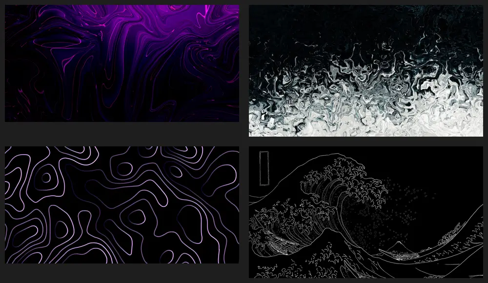 |
| anime | 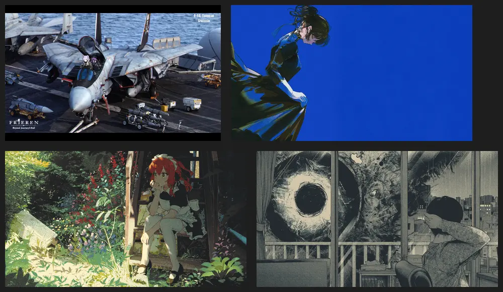 |
| architecture |  |
| artworks | 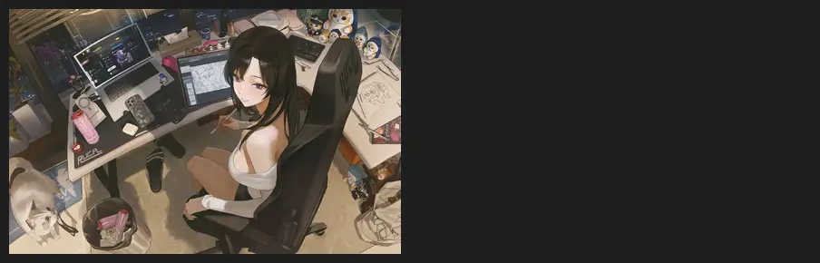 |
| cityspace | 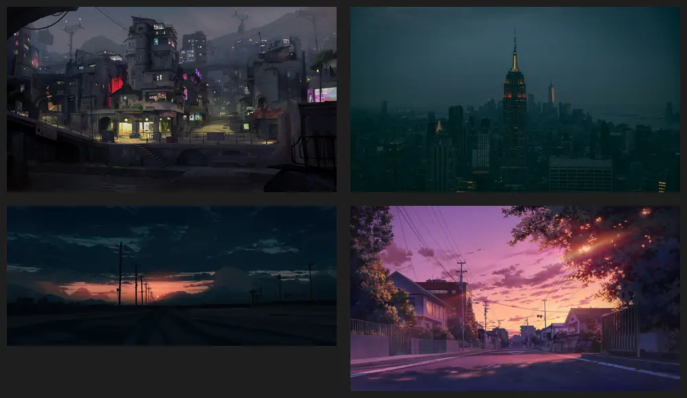 |
| dynamic | 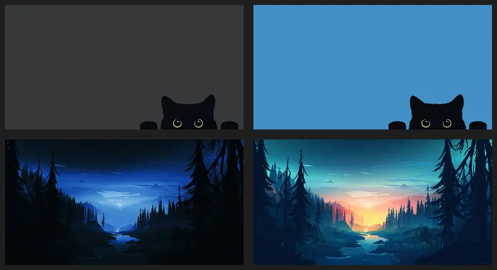 |
| extra |  |
| gaming | 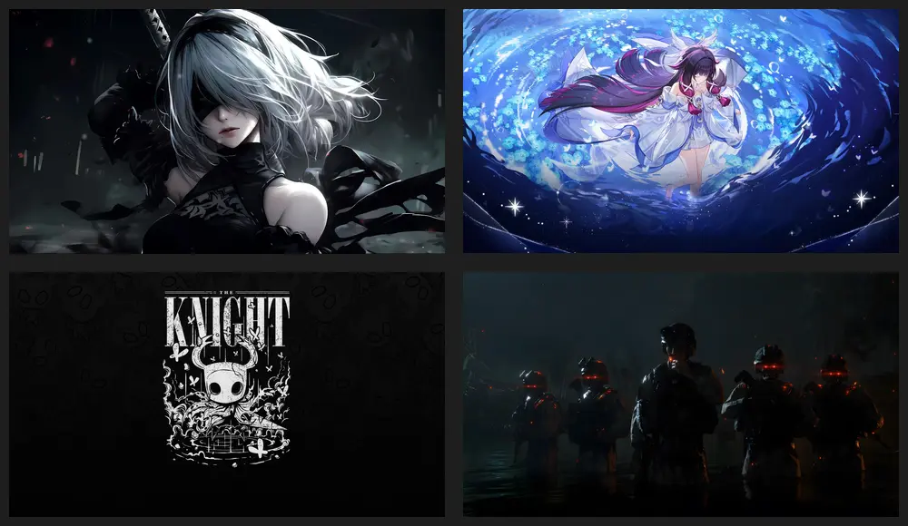 |
| linux | 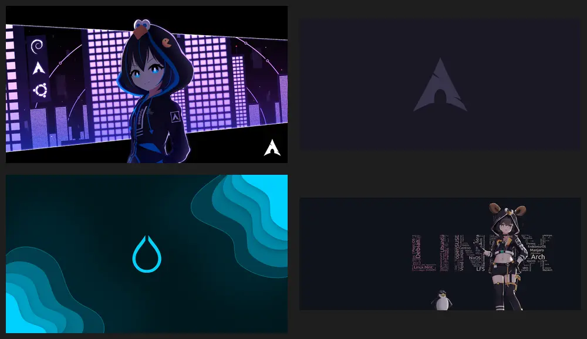 |
| minimal | 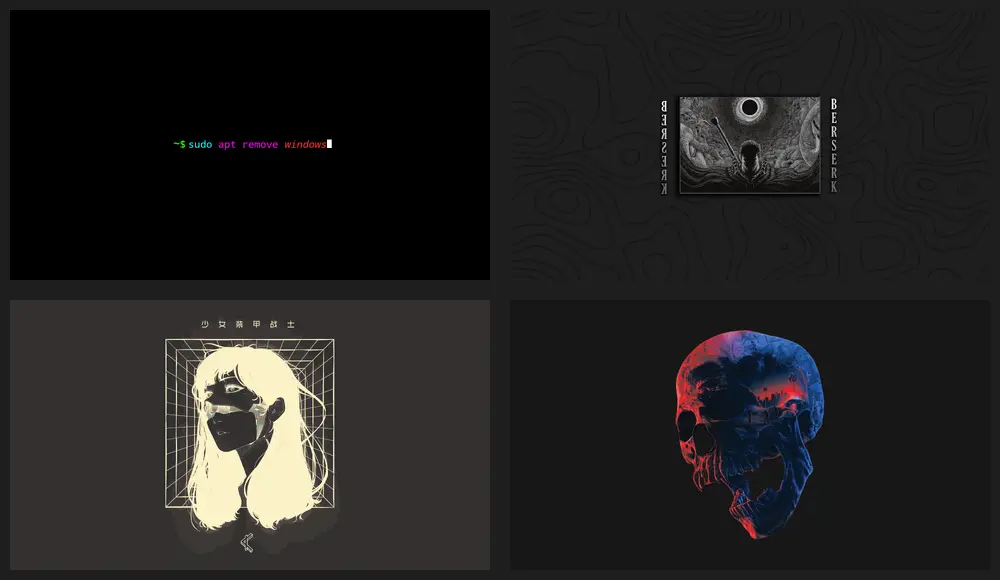 |
| nature |  |
| pixel-art | 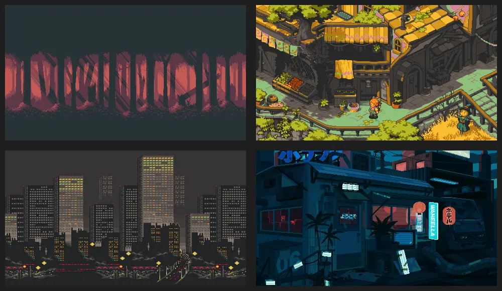 |
| space |  |
| technology | 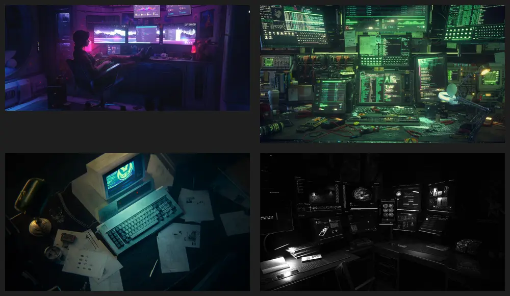 |
| vehicles |  |
| windows | 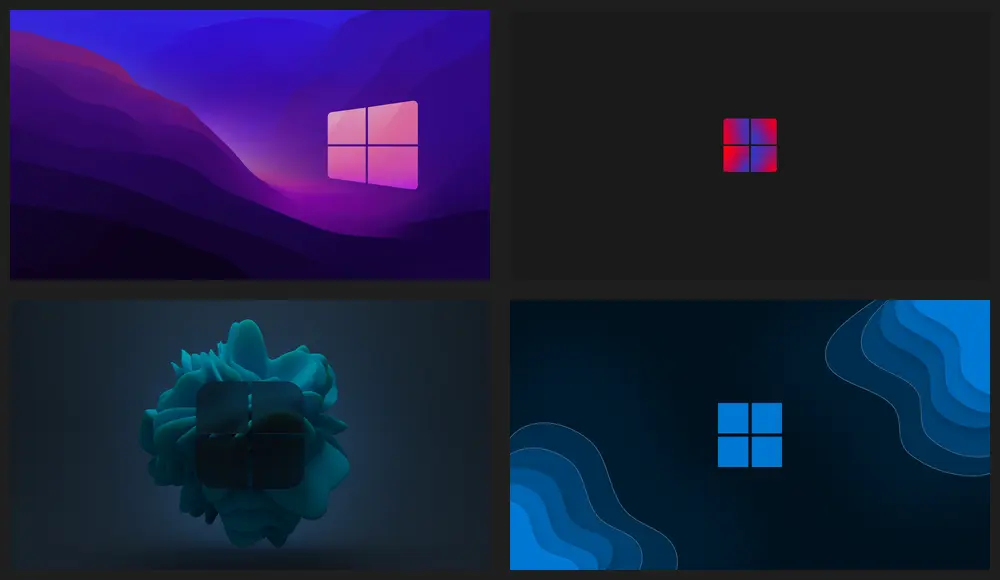 |


### Mobile Wallpapers

| Categories | thumbnails |
| ---------- | ---------- |
| anime | 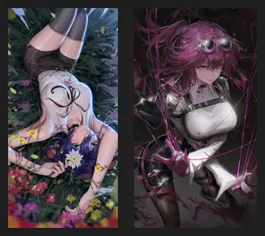 |
| artworks |  |
| cityscape | 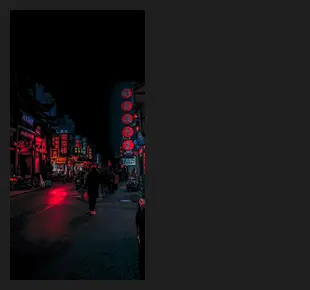 |
| minimal |  |

# Usage

You can download or clone the repository:

```bash
git clone https://github.com/cyber-null/wallpapers.git
```

Then browse categories and pick wallpapers manually.


